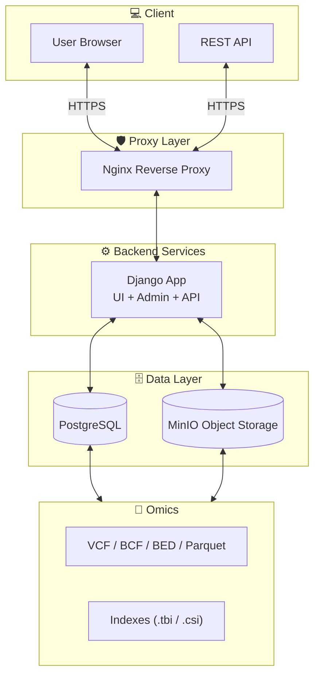

# EBDMS
**Electronic Biomedical Data Management System**

EBDMS is an **open-source, self-hosted platform** for managing biomedical research data.  
It combines **structured clinical / project metadata**, **electronic forms**, and **large genomic files**
into a single, auditable system suitable for academic and regulated environments.

> **Important:**  
> The application coponents (db + minio) are designed to be run **only via Docker Compose**.  

---

## 🎯 Scope & Philosophy

EBDMS is **not**:
- ❌ a clinical-grade EHR replacement
- ❌ a biomedical reference database mirror (ICD, GEO, EGA, etc.)
- ❌ an analysis notebook or workflow engine

EBDMS **is**:
- ✅ a biomedical **data management layer**
- ✅ metadata + file orchestration system
- ✅ audit-friendly backend for research projects
- ✅ a foundation for downstream analysis pipelines

---

## 🧱 System Architecture


```mermaid
flowchart TD
    %% CLIENT
    subgraph Client["💻 Client"]
        Browser[User Browser]
        API[REST API]
    end

    %% PROXY
    subgraph Proxy["🛡️ Proxy Layer"]
        Nginx[Nginx Reverse Proxy]
    end

    %% BACKEND
    subgraph Backend["⚙️ Backend Services"]
        Django[Django App<br/>UI + Admin + API]
    end

    %% DATA
    subgraph Data["🗄️ Data Layer"]
        Postgres[(PostgreSQL)]
        MinIO[(MinIO Object Storage)]
    end

    %% FILES
    subgraph Files["🧬 Omics"]
        FILES["VCF / BCF / BED / Parquet"]
        IDX["Indexes (.tbi / .csi)"]
    end

    Browser <-- HTTPS --> Nginx
    API <-- HTTPS --> Nginx

    Nginx <--> Django
    Django <--> Postgres
    Django <--> MinIO

    Postgres <--> Files 
    MinIO <--> Files
```

## 🐳 Docker & Containers

**EBDMS** is composed of the following core containers:

- postgres – primary relational database (metadata, projects, users)

- minio – S3-compatible object storage (files, media, static)

- minio-init – one-shot bootstrap container (bucket creation + policies)

**In backlog**:
- django – application server (added separately)

- redis – cache + Celery broker (added separately)

- celery – background workers (added separately)

- nginx – reverse proxy (added separately)


** To consider**:
- reversion vs simple-history or custom ?
- implement audits, with middleware - https://django-auditlog.readthedocs.io/en/latest/index.html
- django rules or tenants ?
- add complete and locked status for EHR
- add token-protected, healthcheck/ and stats/ endpoints 
- integrate with prometheus, for multiple instance support 
- add vector field for participant similarity analysis

## ⚙️ Environment Variables

All configuration is done via .env.

```
# ------------------------------------------------------------------
# APP
# ------------------------------------------------------------------
DEBUG=true
MFA=false

DJANGO_SUPERUSER_USERNAME="change-me"
DJANGO_SUPERUSER_PASSWORD="change-me"

# ------------------------------------------------------------------
# MinIO – credentials
# ------------------------------------------------------------------
MINIO_ROOT_USER="change-me"
MINIO_ROOT_PASSWORD="change-me"

# ------------------------------------------------------------------
# MinIO – networking
# ------------------------------------------------------------------
MINIO_PORT="9000"
MINIO_CONSOLE_PORT="9001"

# Internal (Docker ↔ Docker)
MINIO_ENDPOINT_URL="http://127.0.0.1:9000"

# External (Browser / host machine)
MINIO_PUBLIC_URL="http://127.0.0.1:9000"

# ------------------------------------------------------------------
# MinIO – region (explicit)
# ------------------------------------------------------------------
MINIO_REGION="eu-central-1"

# ------------------------------------------------------------------
# MinIO – buckets
# ------------------------------------------------------------------
MINIO_DEFAULT_BUCKET="ebdms-projects-bucket"
MINIO_STATIC_BUCKET="static-files-bucket"

# ------------------------------------------------------------------
# DATABASE CONFIG
# ------------------------------------------------------------------
# POSTGRESQL
POSTGRES_DB="change-me"
POSTGRES_USER="change-me"
POSTGRES_PASSWORD="change-me"
POSTGRES_HOST="localhost"
POSTGRES_PORT="5432"

# ------------------------------------------------------------------
# WHO API (OPTIONAL)
# ------------------------------------------------------------------
ICD_CLIENT_ID="change-me"
ICD_CLIENT_SECRET="change-me"
```

## 🔐 Authentication & MFA

EBDMS supports Multi-Factor Authentication (MFA) `if ENABLE_MFA=true:` for all users, and its based on django-otp TOTP (RFC 6238) 
enforced using custom middleware.

## ▶️ How to Run 

### 1. Start db and storage via compose

```sh
docker compose up -d
```

### 2. Prepare db

```sh
python manage.py makemigrations projects ontologies ehr biobank lims ngs core
python manage.py migrate

python manage.py createinitialrevisions # reversion
```

### 3. Prepare local env
```sh
pip install poetry && poetry install
poetry shell
```

### 4. Prepare app to start 
```sh
python manage.py createsuperuser --no-input
python manage.py collectstatic --no-input
```

### 5. Run app 
```sh
python manage.py runserver
```

## 🗺️ Roadmap / TODO

 - Expand test coverage (models, permissions, API)
 - RBAC / project-level permissions
 - Embeddings for sample and participant for similarity search
 - OpenAPI schema export
 - Add print qr codes to actions
 - Add clone EHR form to actions
 - Tests tests tests 

## 📜 Tests

```sh
poetry run python manage.py test biobank.tests lims.tests projects.tests ehr.tests
```

## Populate random data 

```sh
poetry run python manage.py demo
```

## Purge random data 

```sh
poetry run python manage.py demo --reset
```

## ⚠️ Disclaimer

EBDMS is a research data management system.
It is not a certified medical device and must not be used for direct clinical decision-making.


