EBDMS - electronic biomedical data managment system

```mermaid
flowchart TD
    %% CLIENT
    subgraph Client["💻 Client"]
        Browser[User Browser]
        API[REST API]
    end

    %% PROXY
    subgraph ProxyLayer["🛡️ Proxy Layer"]
        Nginx[Nginx<br/>Reverse Proxy]
    end

    %% BACKEND
    subgraph Backend["⚙️ Backend Services"]
        App[Django services + UI + Admin]
        Celery[Celery Worker<br/>Tasks & Analysis]
        Flower[Flower Dashboard<br/>Monitoring]
    end

    %% DATA
    subgraph Data["🗄️ Data Layer"]
        DB[(PostgresDB)]
        Mongo[(MongoDB)]
        Redis[(Redis: Broker + Cache)]
        Media[Static & Media Volumes]
    end

    %% GENOMIC DATA
    subgraph Genomic["🧬 Genomic data"]
        File["VCF, BCF, BED ..."]
        Index["VCF.tbi, BCF.tbi, BED.tbi ..."]
    end

    %% Electronic Health Record
    subgraph EHR["🏥 Electronic Health Records"]
        EHR-forms["EHR Forms"]
        EHR-data["EHR Records"]
    end

    %% EXTERNAL
    subgraph External["External Resources"]
        HIS-data["🏥 Hospital Information System (HIS)"]
        EGA-data["🧬 European Genome-Phenome Database (EGA)"]
        GEO-data["🧬 Gene Expression Omnibus Database (GEO)"]
    end

    %% FLOWS
    Browser <-- HTTPS/TLS --> Nginx
    API -- HTTPS/TLS --> Nginx
    Nginx <--> App
    Nginx <--> Flower
    Nginx <--> Media

    App <--> DB
    App <--> Mongo
    App <--> Redis
    App <--> Media

    Celery <--> Redis
    Celery <--> DB
    Celery <--> Mongo
    Flower <--> Celery

    Mongo <--> Genomic
    External <--> App
    DB <--> EHR

    %% STYLES (placed at bottom so parser is happy)
    classDef client fill:#FCE7F3,stroke:#EC4899,color:#1F2937,stroke-width:1px;
    classDef proxy fill:#DBEAFE,stroke:#2563EB,color:#1F2937,stroke-width:1px;
    classDef backend fill:#E0F2FE,stroke:#0284C7,color:#1F2937,stroke-width:1px;
    classDef data fill:#DCFCE7,stroke:#16A34A,color:#1F2937,stroke-width:1px;
    classDef external fill:#FEF9C3,stroke:#CA8A04,color:#1F2937,stroke-width:1px;

    class Browser,API client
    class Nginx proxy
    class App,Celery,Flower backend
    class DB,Mongo,Redis,Media data
    class HIS-data,EGA-data,GEO-data,EBI-data,ERP-data,MSigDB-data, external

```



To start
```
pip install poetry
cd ebdms/
poetry install
```

To start app
```
poetry run python manage.py makemigrations
poetry run python manage.py migrate

poetry run python manage.py createsuperuser
poetry run python manage.py runserver
```